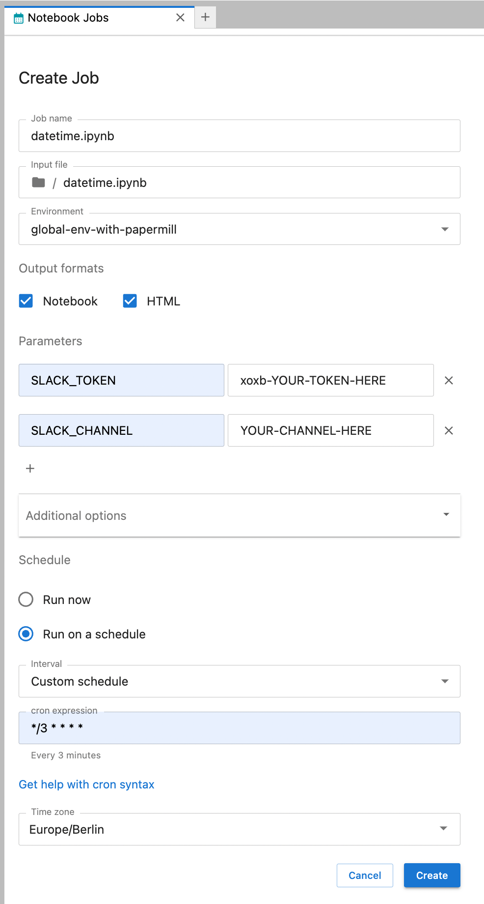
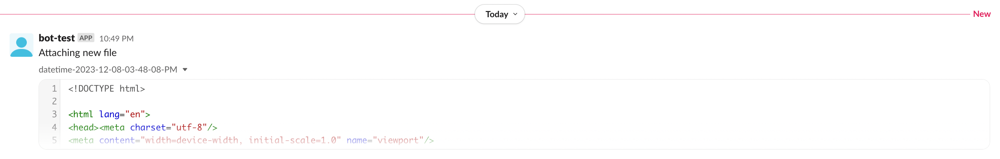

# argo-jupyter-scheduler

[](https://pypi.org/project/argo-jupyter-scheduler)
[](https://pypi.org/project/argo-jupyter-scheduler)

-----

**Table of Contents**

- [argo-jupyter-scheduler](#argo-jupyter-scheduler)
  - [Installation](#installation)
  - [What is it?](#what-is-it)
  - [Optional features](#optional-features)
    - [Sending to Slack](#sending-to-slack)
  - [A deeper dive](#a-deeper-dive)
    - [`Job`](#job)
    - [`Job Definition`](#job-definition)
    - [Internals](#internals)
    - [Output Files](#output-files)
    - [Workflow Steps](#workflow-steps)
  - [Additional thoughts](#additional-thoughts)
  - [Known issues](#known-issues)
  - [License](#license)

**Argo-Jupyter-Scheduler**

Submit long-running notebooks to run without the need to keep your JupyterLab server running. And submit a notebook to run on a specified schedule.

## Installation

```console
pip install argo-jupyter-scheduler
```

## What is it?

Argo-Jupyter-Scheduler is a plugin to the [Jupyter-Scheduler](https://jupyter-scheduler.readthedocs.io/en/latest/index.html) JupyterLab extension.

What does that mean?

This means this is an application that gets installed in the JupyterLab base image and runs as an extension in JupyterLab. Specifically, you will see this icon at the bottom of the JupyterLab Launcher tab:


And this icon on the toolbar of your Jupyter Notebook:


This also means, as a lab extension, this application is running within each user's separate JupyterLab server. The record of the notebooks you've submitted is specific to you and you only. There is no central Jupyter-Scheduler.

However, instead of using the base Jupyter-Scheduler, we are using **Argo-Jupyter-Scheduler**.

Why?

If you want to run your Jupyter Notebook on a schedule, you need to be assured that the notebook will be executed at the times you specified. The fundamental limitation with Jupyter-Scheduler is that when your JupyterLab server is not running, Jupyter-Scheduler is not running. Then the notebooks you had scheduled won't run. What about notebooks that you want to run right now? If the JupyterLab server is down, then how will the status of the notebook run be recorded?

The solution is Argo-Jupyter-Scheduler: Jupyter-Scheduler front-end with an Argo-Workflows back-end.

## Optional features

### Sending to Slack

Argo-Jupyter-Scheduler allows sending HTML output of an executed notebook to a
Slack channel:

- See the Slack API docs on how to create a bot token (starts with `xoxb`)
- Invite your bot to a Slack channel which will be used for sending output
- When scheduling a notebook (as described above):
  - Select a conda environment that has `papermill` installed
  - Add the following `Parameters`:
    - name: `SLACK_TOKEN`, value: `xoxb-<Slack bot token>`
    - name: `SLACK_CHANNEL`, value: `<Slack channel name>` (without leading `#`, like `scheduled-jobs`).

Create job:



Slack output:



## A deeper dive

In the Jupyter-Scheduler lab extension, you can create two things, a `Job` and a `Job Definition`.

### `Job`

A `Job`, or notebook job, is when you submit your notebook to run.

In Argo-Jupyter-Scheduler, this `Job` translates into a `Workflow` in Argo-Workflows. So when you create a `Job`, your notebook job will create a Workflow that will run regardless of whether or not your JupyterLab server is.

> At the moment, permission to submit Jobs is required, managed by the Keycloak roles for the `argo-server-sso` client. If your user has either the `argo-admin` or the `argo-developer` roles, they will be permitted to create and submit Jobs (and Job Definitions).

We are also relying on the [Nebari Workflow Controller](https://github.com/nebari-dev/nebari-workflow-controller) to ensure the user's home directory and conda-store environments are mounted to the Workflow. This allows us to ensure:
- the files in the user's home directory can be used by the notebook job
- the output of the notebook can be saved locally
- when the conda environment that is used gets updated, it is also updated for the notebook job (helpful for scheduled jobs)
- the node-selector and image you submit your notebook job from are the same ones used by the workflow


### `Job Definition`

A `Job-Definition` is simply a way to create to Jobs that run on a specified schedule.

In Argo-Jupyter-Scheduler, `Job Definition` translate into a `Cron-Workflow` in Argo-Workflows. So when you create a `Job Definition`, you create a `Cron-Workflow` which in turn creates a `Workflow` to run when scheduled.

A `Job` is to `Workflow` as `Job Definition` is to `Cron-Workflow`.


### Internals

Jupyter-Scheduler creates and uses a `scheduler.sqlite` database to manage and keep track of the Jobs and Job Definitions. If you can ensure this database is accessible and can be updated when the status of a job or a job definition change, then you can ensure the view the user sees from JupyterLab match is accurate.

> By default this database is located at `~/.local/share/jupyter/scheduler.sqlite` but this is a traitlet that can be modified. And since we have access to this database, we can update the database directly from the workflow itself.

To accomplish this, the workflow runs in two steps. First the workflow runs the notebook, using `papermill` and the conda environment specified. And second, depending on the success of this notebook run, updates the database with this status.

And when a job definition is created, a corresponding cron-workflow is created. To ensure the database is properly updated, the workflow that the cron-workflow creates has these three steps. First, create a job record in the database with a status of `IN PROGRESS`. Second, run the notebook, again using `papermill` and the conda environment specified. And third, update the newly created job record with the status of the notebook run.

### Output Files

In addition to `papermill`, which creates the output notebook, `jupyter
nbconvert` is used to produce HTML output. To make these output files
downloadable via the web UI, it's important they match the format that
Jupyter-Scheduler expects, which is achieved by reusing `create_output_filename`
within Argo-Jupyter-Scheduler when creating output files.

The expected output filenames include timestamps that must match the start time
of a job. For cron jobs this is tricky because the start time is set whenever
`create-job-id` is run. All workflow steps are run in separate containers and
the `create-job-id` container is run after the `papermill` step, which creates
the output files.

Also, the `papermill` container is defined differently because it needs to have
access to filesystem mount points where the `papermill` and `jupyter` commands
are located as well as access the environment variables. Due to this, the
commands executed within the `papermill` container cannot be changed once it's
been defined.

This also means that the `papermill` container cannot have access to the job
start time and hence cannot create filenames with the expected timestamps. To
solve this problem, the `papermill` step always creates output files with the
same default filenames and there is an additional `rename-files` step that runs
after `create-job-id`, which makes sure the timestamps match the job start time.
To pass the start time value between containers, the SQLite database is used.

Finally, because `create-job-id` creates a new job every time it runs, this job
will also have a new id. The job id is important since it's the same as the name
of the staging directory where job output files are expected to be found by
Jupyter-Scheduler. But the output files are created in the `papermill` step,
which has the id of a job that defined the workflow originally when it was
scheduled, not the current one created in `create-job-id`. To point to the
proper location on disk, a symlink is created connecting staging job
directories. This is also done in the `rename-files` step by looking up the job
ids in the SQLite database.

For non-cron jobs, there is no `create-job-id` step. The rest of the workflow
steps are the same, but no database lookups are performed and no symlinks are
created. This is not necessary because the start time is immediately available
and the job id matches the job staging area.

### Workflow Steps

Here's the overview of the workflow steps:

- `main` runs `papermill` and `jupyter nbconvert` to create output files
- `create-job-id` creates a new job that can run without JupyterLab (only
  for cron jobs)
- `rename-files` updates timestamps of output files and adds symlinks between
  job staging directories
- `send-to-slack` sends HTML output to a Slack channel (only if `SLACK_TOKEN`
  and `SLACK_CHANNEL` are provided via `Parameters` when scheduling a job)
- `failure` or `success` sets status as "Failed" or "Completed" in the web UI.

These steps are executed sequentially in separate containers. If a step fails,
the `failure` step is called in the end. Otherwise, the `success` step is
called.

## Additional Thoughts

At the moment, Argo-Jupyter-Scheduler is closely coupled with Nebari (via the Nebari-Workflow-Controller) which doesn't make it very useable for other projects. There's no need for this to necessarily be the case. By leveraging Traitlets, we can include other ways of modifying the pod spec for the running workflow and enable it to be used by other projects. If you're interested in this project and would like to see it extended, feel free to open an issue to discuss your ideas. Thank you :)

## Known Issues

All of the core features of Jupyter-Scheduler have been mapped over to Argo-Jupyter-Scheduler. Unfortunately, there is currently a limitation with `Update Job Definition` and with `Pause`/`Resume` for Job Definitions. Although the `Pause` works, the `Resume` fails for the same reason `Update Job Definition` does and this is because the upstream Nebari-Workflow-Controller (see [Known Limitations](https://github.com/nebari-dev/nebari-workflow-controller#known-limitations)) has a limitation whereby it can't resubmit workflows/cron-workflows; there are more details in [this issue](https://github.com/nebari-dev/nebari-workflow-controller/issues/18).

## License

`argo-jupyter-scheduler` is distributed under the terms of the [MIT](https://spdx.org/licenses/MIT.html) license.
